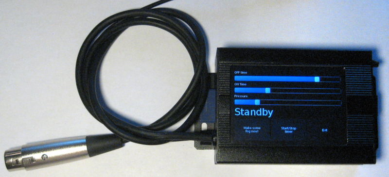
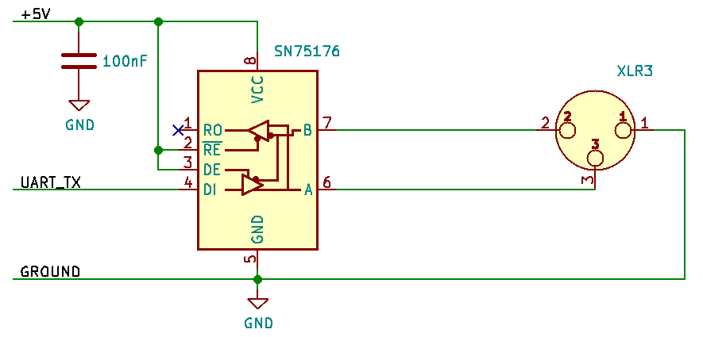

# dmxpi

At first, I was in a hurry and just needed a NE555 to command a fog machine, but decided to make a python app and to use OLA on a raspberry pi with a touch screen. It uses the "UART native DMX" module.

[Webpage](http://clx.freeshell.org/ola-raspberry-uart-dmx.html)

Small demo on [YT](https://www.youtube.com/watch?v=7jmNICUkqHE) or  [Odysee](https://odysee.com/@cLxJaggy:4/dmx-with-a-raspberry-pi,-spi:4)

## Files

* `launcher.py` Main interface to be run at startup, and permits to run other scripts by big buttons. Shows the IP address and restart OLAd when detects a change
* `fog-gui.py` Timer app for fog machine
* `monitor.py` Displays the values of DMX channels

## Hardware

